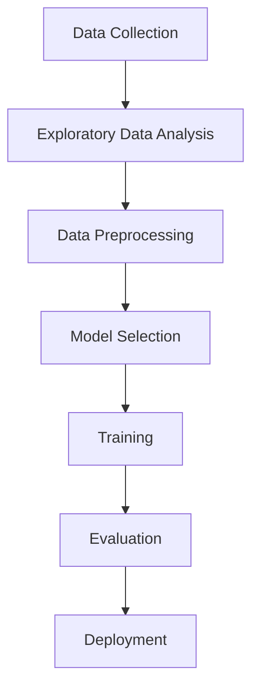

# Machine Learning Practice

This repository serves as a collection of my work and learning in machine learning while my internship in Cellual-Technologies, 
including algorithm explanations, data preprocessing workflows, and two projects.

---

## 🛠 General Workflow

Before training any machine learning model, we go through **Exploratory Data Analysis (EDA)** and **Data Preprocessing**.  
These steps ensure that the dataset is clean, consistent, and ready for modeling.

### 1️⃣ Exploratory Data Analysis (EDA)
EDA helps understand the dataset’s structure, patterns, and potential issues.
- **Understanding the data** – Checking data types, dimensions, and sample values.
- **Statistical summary** – Using `describe()` to find mean, median, min, max, etc.
- **Missing values** – Identifying and deciding how to handle NaN values.
- **Data distribution** – Plotting histograms, KDE plots, and boxplots.
- **Outlier detection** – Using visualization and statistical methods like IQR.
- **Correlation analysis** – Finding relationships between variables with heatmaps.

### 2️⃣ Data Preprocessing
Once we understand the data, preprocessing ensures it’s ready for algorithms.
- **Handling missing values** – Imputation with mean/median/mode or removal.
- **Encoding categorical variables** – One-hot encoding or label encoding.
- **Feature scaling** – Normalization or Standardization for numerical features.
- **Feature engineering** – Creating new features from existing ones.
- **Splitting data** – Training/testing (and validation) sets to evaluate models.

---

---

# 📚 Machine Learning Algorithms

Below is a categorized explanation of various algorithms.

---
### **II. Supervised Learning**
Algorithms that find patterns with labeled data.

#### 1. Linear Regression
- **Type**: Regression
- **Use case**: Predicting continuous values.
- **Concept**: Fits a straight line that minimizes the difference between predicted and actual values (using least squares method).
- **Key points**:
  - Assumes a linear relationship between variables.
  - Sensitive to outliers.
  - Example: Predicting house prices.

#### 2. Polynomial Regression
- **Type**: Regression
- **Use case**: Modeling non-linear relationships.
- **Concept**: Extends linear regression by adding polynomial terms (x², x³, …).
- **Key points**:
  - Fits a curve instead of a straight line.
  - Risk of overfitting with high polynomial degree.

#### 3. Logistic Regression
- **Type**: Classification
- **Use case**: Predicting binary or multi-class categories.
- **Concept**: Uses a sigmoid function to output probabilities for class membership.
- **Key points**:
  - Despite its name, it’s a classification algorithm.
  - Example: Spam detection.

#### 4. K-Nearest Neighbors (KNN)
- **Type**: Classification/Regression
- **Use case**: Classifying data points based on their closest neighbors.
- **Concept**: Looks at the “k” nearest data points and assigns the majority class (classification) or average (regression).
- **Key points**:
  - Simple, non-parametric method.
  - Computationally expensive for large datasets.

#### 5. Support Vector Machine (SVM)
- **Type**: Classification/Regression
- **Use case**: Separating data into distinct classes with the widest possible margin.
- **Concept**: Finds an optimal hyperplane that maximizes the margin between classes.
- **Key points**:
  - Works well with high-dimensional data.
  - Can use kernels for non-linear separation.

#### 6. Naïve Bayes
- **Type**: Classification
- **Use case**: Text classification, spam filtering.
- **Concept**: Based on Bayes’ theorem with the assumption of feature independence.
- **Key points**:
  - Fast and efficient.
  - Works well with high-dimensional data (e.g., text).

#### 7. Decision Tree
- **Type**: Classification/Regression
- **Use case**: Predicting classes or values by splitting data into branches.
- **Concept**: Divides data based on feature values until reaching a decision.
- **Key points**:
  - Easy to interpret.
  - Can overfit without pruning.

#### 8. Random Forest
- **Type**: Classification/Regression
- **Use case**: More robust version of Decision Tree.
- **Concept**: Combines multiple decision trees (ensemble) and averages results.
- **Key points**:
  - Reduces overfitting.
  - Works well for a wide range of problems.

---

### **II. Unsupervised Learning**
Algorithms that find patterns without labeled data.

#### 9. K-Means Clustering
- **Type**: Clustering
- **Use case**: Grouping similar data points.
- **Concept**: Partitions data into “k” clusters by minimizing distances within clusters.
- **Key points**:
  - Requires specifying “k” in advance.
  - Sensitive to initial centroids.

#### 10. Hierarchical Clustering
- **Type**: Clustering
- **Use case**: Creating a hierarchy of clusters.
- **Concept**: Builds nested clusters using a tree-like diagram (dendrogram).
- **Key points**:
  - No need to predefine number of clusters.
  - Computationally intensive for large datasets.

#### 11. DBSCAN (Density-Based Spatial Clustering of Applications with Noise)
- **Type**: Clustering
- **Use case**: Identifying clusters of arbitrary shape.
- **Concept**: Groups together points that are closely packed and marks outliers.
- **Key points**:
  - No need to specify number of clusters.
  - Handles noise well.

---

### **III. Dimensionality Reduction**

#### 12. Principal Component Analysis (PCA)
- **Type**: Feature reduction
- **Use case**: Reducing high-dimensional data while retaining variance.
- **Concept**: Transforms features into new uncorrelated variables (principal components).
- **Key points**:
  - Speeds up computation.
  - Useful for visualization of complex datasets.

---

## 📌 Conclusion

This repository combines theory and practice, providing algorithm explanations and real project implementations.
It can be used as a reference for machine learning studies and practical applications.

