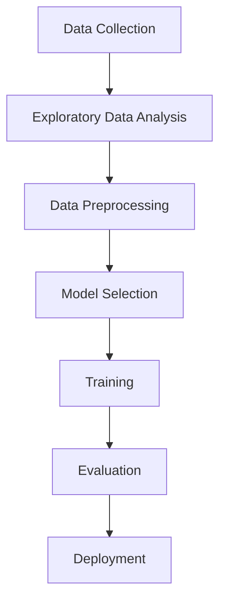

# Machine Learning Practice

This repository serves as a collection of my work and learning in machine learning while my internship in Cellual-Technologies, 
including algorithm explanations, data preprocessing workflows, and two projects.

---
## Table of Contents
- [🛠 General Workflow](#-general-workflow)
  - [1️⃣ Exploratory Data Analysis (EDA)](#️-exploratory-data-analysis-eda)
  - [2️⃣ Data Preprocessing](#️-data-preprocessing)
- [📚 Machine Learning Algorithms](#-machine-learning-algorithms)
  - [II. Supervised Learning](#ii-supervised-learning)
  - [II. Unsupervised Learning](#ii-unsupervised-learning)
  - [III. Dimensionality Reduction](#iii-dimensionality-reduction)
- [📊 Model Evaluation Metrics](#-model-evaluation-metrics)
  - [1. Regression Metrics](#1-regression-metrics)
  - [2. Classification Metrics](#2-classification-metrics)
  - [3. Clustering Metrics](#3-clustering-metrics)
- [Projects](#projects)
  - [Project 1: Hotel Booking Cancellation Prediction](#project-1-hotel-booking-cancellation-prediction)
  - [Project 2: NYC Taxi Fare Prediction](#project-2-nyc-taxi-fare-prediction)
- [📌 Conclusion](#-conclusion)

Note: The supervised learning section is incorrectly numbered as "II" instead of "I". This should be fixed.

## 🛠 General Workflow

Before training any machine learning model, we go through **Exploratory Data Analysis (EDA)** and **Data Preprocessing**.  
These steps ensure that the dataset is clean, consistent, and ready for modeling.

### 1️⃣ Exploratory Data Analysis (EDA)
EDA helps understand the dataset’s structure, patterns, and potential issues.
- **Understanding the data** – Checking data types, dimensions, and sample values.
- **Statistical summary** – Using `describe()` to find mean, median, min, max, etc.
- **Missing values** – Identifying and deciding how to handle NaN values.
- **Data distribution** – Plotting histograms, KDE plots, and boxplots.
- **Outlier detection** – Using visualization and statistical methods like IQR.
- **Correlation analysis** – Finding relationships between variables with heatmaps.

### 2️⃣ Data Preprocessing
Once we understand the data, preprocessing ensures it’s ready for algorithms.
- **Handling missing values** – Imputation with mean/median/mode or removal.
- **Encoding categorical variables** – One-hot encoding or label encoding.
- **Feature scaling** – Normalization or Standardization for numerical features.
- **Feature engineering** – Creating new features from existing ones.
- **Splitting data** – Training/testing (and validation) sets to evaluate models.

---

---

# 📚 Machine Learning Algorithms

Below is a categorized explanation of various algorithms.

---
### **II. Supervised Learning**
Algorithms that find patterns with labeled data.

#### 1. Linear Regression
- **Type**: Regression
- **Use case**: Predicting continuous values.
- **Concept**: Fits a straight line that minimizes the difference between predicted and actual values (using least squares method).
- **Key points**:
  - Assumes a linear relationship between variables.
  - Sensitive to outliers.
  - Example: Predicting house prices.

#### 2. Polynomial Regression
- **Type**: Regression
- **Use case**: Modeling non-linear relationships.
- **Concept**: Extends linear regression by adding polynomial terms (x², x³, …).
- **Key points**:
  - Fits a curve instead of a straight line.
  - Risk of overfitting with high polynomial degree.

#### 3. Logistic Regression
- **Type**: Classification
- **Use case**: Predicting binary or multi-class categories.
- **Concept**: Uses a sigmoid function to output probabilities for class membership.
- **Key points**:
  - Despite its name, it’s a classification algorithm.
  - Example: Spam detection.

#### 4. K-Nearest Neighbors (KNN)
- **Type**: Classification/Regression
- **Use case**: Classifying data points based on their closest neighbors.
- **Concept**: Looks at the “k” nearest data points and assigns the majority class (classification) or average (regression).
- **Key points**:
  - Simple, non-parametric method.
  - Computationally expensive for large datasets.

#### 5. Support Vector Machine (SVM)
- **Type**: Classification/Regression
- **Use case**: Separating data into distinct classes with the widest possible margin.
- **Concept**: Finds an optimal hyperplane that maximizes the margin between classes.
- **Key points**:
  - Works well with high-dimensional data.
  - Can use kernels for non-linear separation.

#### 6. Naïve Bayes
- **Type**: Classification
- **Use case**: Text classification, spam filtering.
- **Concept**: Based on Bayes’ theorem with the assumption of feature independence.
- **Key points**:
  - Fast and efficient.
  - Works well with high-dimensional data (e.g., text).

#### 7. Decision Tree
- **Type**: Classification/Regression
- **Use case**: Predicting classes or values by splitting data into branches.
- **Concept**: Divides data based on feature values until reaching a decision.
- **Key points**:
  - Easy to interpret.
  - Can overfit without pruning.

#### 8. Random Forest
- **Type**: Classification/Regression
- **Use case**: More robust version of Decision Tree.
- **Concept**: Combines multiple decision trees (ensemble) and averages results.
- **Key points**:
  - Reduces overfitting.
  - Works well for a wide range of problems.

---

### **II. Unsupervised Learning**
Algorithms that find patterns without labeled data.

#### 9. K-Means Clustering
- **Type**: Clustering
- **Use case**: Grouping similar data points.
- **Concept**: Partitions data into “k” clusters by minimizing distances within clusters.
- **Key points**:
  - Requires specifying “k” in advance.
  - Sensitive to initial centroids.

#### 10. Hierarchical Clustering
- **Type**: Clustering
- **Use case**: Creating a hierarchy of clusters.
- **Concept**: Builds nested clusters using a tree-like diagram (dendrogram).
- **Key points**:
  - No need to predefine number of clusters.
  - Computationally intensive for large datasets.

#### 11. DBSCAN (Density-Based Spatial Clustering of Applications with Noise)
- **Type**: Clustering
- **Use case**: Identifying clusters of arbitrary shape.
- **Concept**: Groups together points that are closely packed and marks outliers.
- **Key points**:
  - No need to specify number of clusters.
  - Handles noise well.

---

### **III. Dimensionality Reduction**

#### 12. Principal Component Analysis (PCA)
- **Type**: Feature reduction
- **Use case**: Reducing high-dimensional data while retaining variance.
- **Concept**: Transforms features into new uncorrelated variables (principal components).
- **Key points**:
  - Speeds up computation.
  - Useful for visualization of complex datasets.

---
## 📊 Model Evaluation Metrics

Evaluating machine learning models is essential to understand how well they generalize to unseen data.  
Below are common evaluation metrics grouped by problem type.

---

### **1. Regression Metrics**

#### **Mean Absolute Error (MAE)**
Measures the average magnitude of errors without considering their direction.

`MAE = (1/n) * Σ |yᵢ - ŷᵢ|`

- **Pros**: Easy to interpret, less sensitive to outliers than MSE.  
- **Cons**: Does not penalize large errors as strongly.

---

#### **Mean Squared Error (MSE)**
Measures the average of squared differences between actual and predicted values.

`MSE = (1/n) * Σ (yᵢ - ŷᵢ)²`

- **Pros**: Penalizes large errors more than MAE.  
- **Cons**: Sensitive to outliers.

---

#### **Root Mean Squared Error (RMSE)**
Square root of MSE, bringing it back to the same units as the target variable.

`RMSE = √( (1/n) * Σ (yᵢ - ŷᵢ)² )`

- **Pros**: More interpretable than MSE.  
- **Cons**: Same sensitivity to outliers as MSE.

---

#### **R² Score (Coefficient of Determination)**
Measures the proportion of variance in the dependent variable explained by the model.

`R² = 1 - [ Σ (yᵢ - ŷᵢ)² / Σ (yᵢ - ȳ)² ]`

- **Range**: 0 to 1 (Higher is better, negative means worse than a horizontal line).  
- **Pros**: Gives a percentage interpretation.  
- **Cons**: Can be misleading for non-linear models.

---

### **2. Classification Metrics**

#### **Accuracy**
The proportion of correct predictions out of total predictions.

`Accuracy = (TP + TN) / (TP + TN + FP + FN)`

---

#### **Precision**
Measures the percentage of positive predictions that are actually correct.

`Precision = TP / (TP + FP)`

---

#### **Recall (Sensitivity or True Positive Rate)**
Measures the percentage of actual positives correctly identified.

`Recall = TP / (TP + FN)`

---

#### **F1 Score**
Harmonic mean of Precision and Recall.

`F1 = 2 * (Precision * Recall) / (Precision + Recall)`

---

#### **ROC-AUC (Area Under the Receiver Operating Characteristic Curve)**
- **ROC Curve**: Plots True Positive Rate vs. False Positive Rate at different thresholds.  
- **AUC**: Measures the overall ability of the model to discriminate between classes.  
- **Range**: 0 to 1 (Higher is better).

---

### **3. Clustering Metrics**

#### **Silhouette Score**
Measures how similar an object is to its own cluster compared to other clusters.

`s = (b - a) / max(a, b)`  

Where:  
- `a` = mean intra-cluster distance  
- `b` = mean nearest-cluster distance  

---

#### **Davies–Bouldin Index**
Measures the average similarity between each cluster and its most similar cluster.

`DB = (1/n) * Σ maxⱼ≠ᵢ [ (σᵢ + σⱼ) / d(cᵢ, cⱼ) ]`  

Where:  
- `σ` = average distance between points in a cluster and the cluster centroid  
- `d(cᵢ, cⱼ)` = distance between cluster centroids  

Lower DB index means better clustering.

---

✅ **Tip**: Always choose the metric based on the problem type and business goal. For example:  
- Regression → MAE, RMSE, R²  
- Classification → F1, Precision-Recall, ROC-AUC  
- Clustering → Silhouette, Davies–Bouldin

## Projects

### [Project 1: Hotel Booking Cancellation Prediction](/Project_1/README.ipynb)

  

  

### [Project 2: NYC Taxi Fare Prediction](/Project_2/README.ipynb)

  

  

## 📌 Conclusion

This repository combines theory and practice, providing algorithm explanations and real project implementations.
It can be used as a reference for machine learning studies and practical applications.

